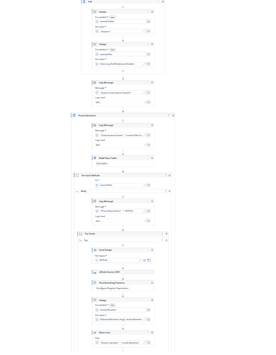
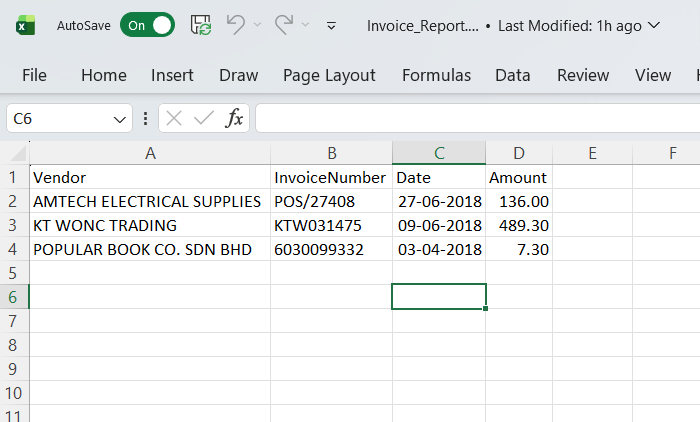

# 📄 Invoice Processing Automation Bot (UiPath)

An RPA bot that automatically extracts invoice data using OCR and generates a structured Excel report.

---

## 🚀 Features

- OCR based invoice text extraction
- Regex-based data parsing
- Vendor name detection
- Invoice number extraction
- Date normalization
- Amount extraction
- Excel report generation
- Error handling with Try-Catch
- Processed / Failed file handling

---

## 🛠 Technologies Used

- UiPath Studio
- OCR (Google OCR / Tesseract)
- Regular Expressions
- Excel Automation
- DataTables

---

## 📂 Project Structure

```
Invoices/      → Input invoices
Processed/     → Successfully processed invoices
Failed/        → Failed invoices
Reports/       → Generated Excel reports
Main.xaml      → Main automation workflow
```

---

## ⚙️ Workflow Overview

1. Read invoice images from folder
2. Extract text using OCR
3. Parse invoice details using Regex
4. Clean and normalize extracted data
5. Store results in DataTable
6. Generate Excel report
7. Move files to Processed / Failed folders

---

## 📸 Workflow



---

## 📊 Output Report



---

## 🎥 Demo


---

## 📌 Sample Extracted Fields

| Vendor | Invoice Number | Date | Amount |
|------|------|------|------|
| AMTECH ELECTRICAL SUPPLIES | POS/27408 | 27-06-2018 | 136.00 |
| KT WONC TRADING | KTW031475 | 09-06-2018 | 489.30 |
| POPULAR BOOK CO. SDN BHD | 6030099332 | 03-04-2018 | 7.30 |

---

## 📈 Future Improvements

- Duplicate invoice detection
- Structured logging system
- Queue-based processing (REFramework)
- API integration

---

## 👨‍💻 Author

Mohammed Raees
